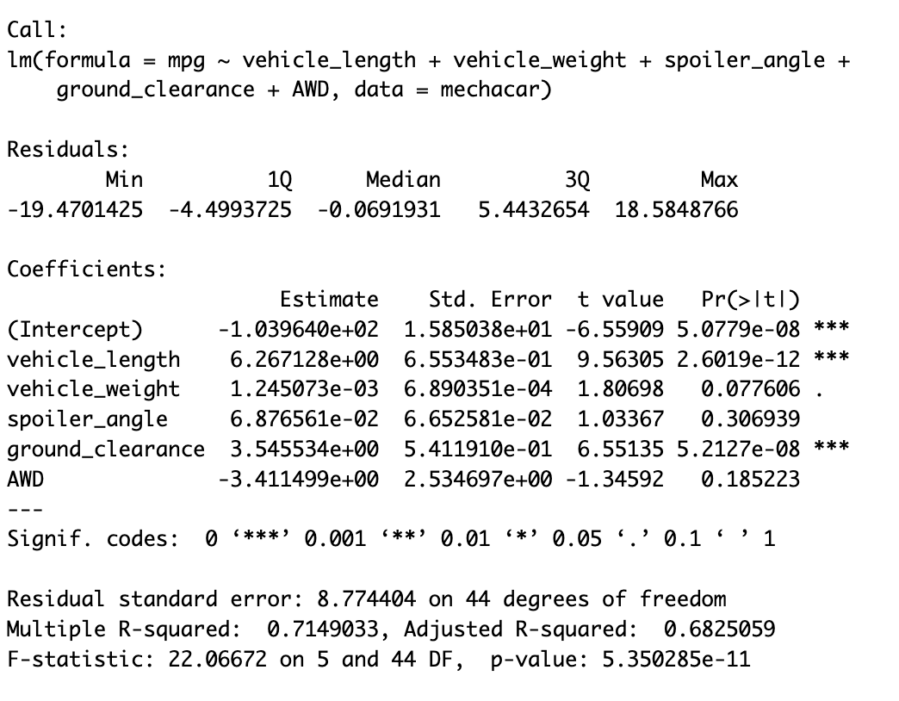
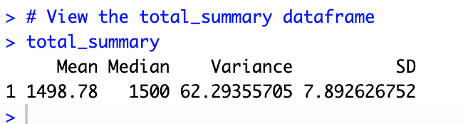
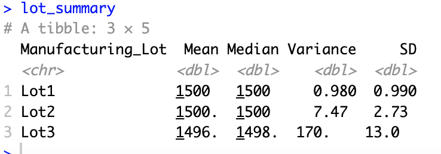
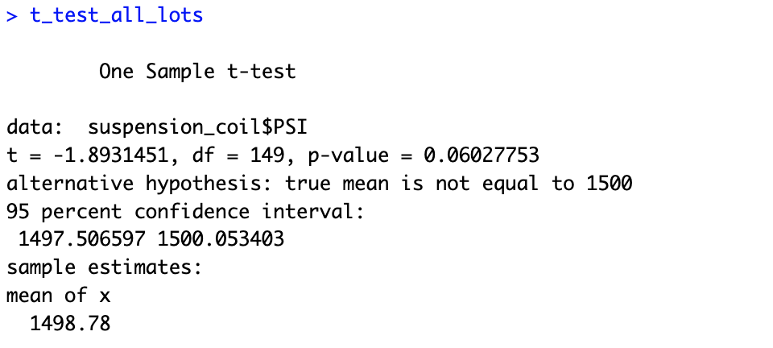
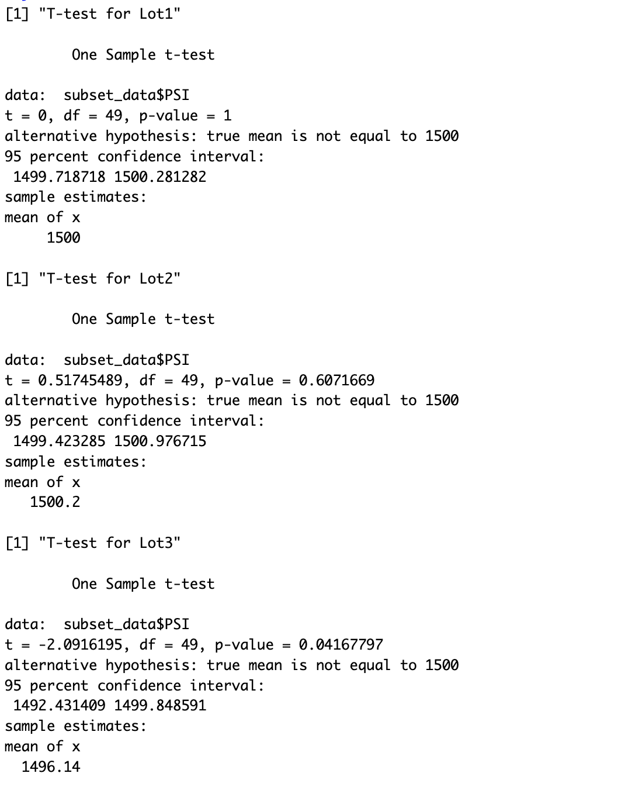

# mechacar-statistics

## Linear Regression to predict MPG

The linear regression model was used to predict the miles per gallon (mpg) of MechaCar prototypes. The model includes five predictor variables: vehicle length, vehicle weight, spoiler angle, ground clearance, and whether the car has all-wheel drive (AWD).
The output shows that vehicle length, ground clearance, and the intercept (or constant term) are statistically significant predictors of mpg. The coefficients of these variables provide a non-random amount of variance to the mpg values in the dataset.
The slope of the linear model is not considered to be zero because the p-value of the F-statistic is very small (5.35e-11), indicating that at least one of the predictor variables has a significant effect on the response variable (mpg).
The adjusted R-squared value of 0.68 suggests that the model explains about 68% of the variance in mpg. While this is a moderate level of prediction, it still indicates that the linear model can effectively predict mpg of MechaCar prototypes to some extent.

## Summary Statistics on Suspension Coils

The MechaCar suspension coils are designed to meet a maximum variance of 100 pounds per square inch (PSI). To assess whether this design specification is being met, summary statistics were calculated for the total dataset as well as for each manufacturing lot.
The total_summary dataframe shows that the mean PSI for all manufacturing lots combined is 1498.78, the median is 1500, the variance is 62.29, and the standard deviation is 7.89.
The lot_summary dataframe shows that Lot 1 has a variance of 0.98 PSI, which is well within the design specifications. Lot 2 has a variance of 7.47 PSI, also meeting the design specifications. However, Lot 3 has a much larger variance of 170 PSI, which does not meet the design specifications.
In summary, the current manufacturing data does not meet the design specification for all manufacturing lots in total because the overall variance is 62.29 PSI, which exceeds the maximum allowable variance of 100 PSI. However, Lot 1 and Lot 2 meet the design specifications individually, while Lot 3 does not. Therefore, the manufacturing process needs to be improved for Lot 3 to ensure that it meets the design specifications.

## T-Tests on Suspension Coils

For the entire dataset, the one-sample t-test showed that the p-value was 0.06027753, which is greater than the significance level of 0.05. This indicates that we cannot reject the null hypothesis that the true population mean is equal to 1500 PSI. Therefore, there is no significant difference between the sample mean (1498.78 PSI) and the population mean (1500 PSI).
However, when we conducted t-tests on each manufacturing lot individually, we found that Lot3 had a p-value of 0.04167797, which is less than the significance level of 0.05. This means we can reject the null hypothesis and conclude that the true population mean for Lot3 is significantly different from 1500 PSI. The mean PSI for Lot3 is 1496.14 PSI, which is below the target mean of 1500 PSI.
In contrast, the t-tests for Lot1 and Lot2 show that the p-values were greater than the significance level of 0.05. This suggests that we cannot reject the null hypothesis that the true population mean is equal to 1500 PSI for both of these manufacturing lots. The mean PSI for Lot1 and Lot2 are both very close to the target mean of 1500 PSI, with mean PSI of 1500 and 1500.2 PSI, respectively.
Overall, the manufacturing data meets the design specifications for the MechaCar suspension coils in all manufacturing lots except for Lot3, which has a mean PSI that is significantly lower than the target mean of 1500 PSI.

## Study Design: Mechacar vs Competition

Metric to be tested: Maintenance cost
Null hypothesis: There is no significant difference in the maintenance cost of MechaCar and its competitors.
Alternative hypothesis: MechaCar has significantly lower maintenance costs than its competitors.
Statistical test: Two-sample t-test.
Data description: Data will be collected on the maintenance costs of MechaCar and its competitors, including Toyota Corolla, Honda Civic, Ford Focus, and Chevrolet Cruze. A sample of at least 50 cars from each manufacturer will be randomly selected, and their maintenance costs over a one-year period will be recorded.
The data will be analyzed using a two-sample t-test, which will compare the mean maintenance cost of MechaCar and its competitors. The null hypothesis will be rejected if the p-value is less than 0.05, indicating that there is a significant difference in maintenance costs between MechaCar and its competitors.
The study will provide valuable insights into the maintenance costs of MechaCar and its competitors, which can help inform potential buyers and improve MechaCar's market position. The data for the statistical test can be obtained by reaching out to dealerships or owners of the respective car models and asking for the maintenance cost data over the same one-year period.

